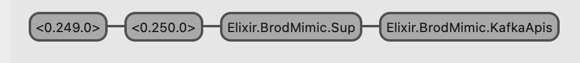

# BrodMimic

An Elixir project to explore the Erlang library
[brod](https://github.com/kafka4beam/brod/tree/master) by porting it to Elixir.

This project was created for a couple of reasons.

1. The `brod` library is the most popular means in Elixir to interface with Kafka.
2. Elixir developers generally lack knowledge on how to read the Erlang code.
   The `brod` code is complex and the end result is that Elixir developers may try
   and use the library as a black-box and that falls apart if problems occur
   that require some knowledge of how the library is talking to Kafka.
3. I figured having an Elixir implementation would allow Elixir developers to
   examine this code and then have a clearer understanding of how `brod` works.
   To make this a reality I needed to:
   - convert the `brod` code file by file (so that a developer looking at the code could
     align what is in this library with the`brod` code). So, for example, in the `brod`
     library there is a `src/brod_consumers_sup.erl` file. In this library there is a
     `lib/brod_mimic/consumers_sup.ex` file.
   - modify doc so that the information aligns with usage from Elixir (the `brod` documentation
     is written from an Erlang perspective)
   - add documentation that clarifies some of the more complicated aspects of the code

Developers should not use this library in lieu of `brod`. It's not nearly production
ready and the `brod` library has been used for years by all sorts of companies. This
project is meant to be educational.

## License/Notice

The `brod` library has an Apache 2.0 license. The same license is set for this
repo. The `brod` library includes the following notice:

```
Kafka client library in Erlang
Copyright 2014-2021 Klarna Bank AB (publ)

This product includes software developed by
Klarna Bank AB (publ) (https://www.klarna.com)
```

## Porting Notes

### Code matches brod

Erlang functions like `:application.get_env` were converted to their Elixir
equivalents. In most cases the Elixir function has the same name so it's not too
hard to compare the `brod` code with this converted code.

The intention is to pull available doc from the `brod` code base and incorporate
it into this library. When the doc is moved over its edited to align with Elixir
naming and general standards. The goal is to make the doc as accessible as
possible for Elixir developers.

### New functions

There are cases where new functions are introduced in the Elixir version.
Generally, this is to deal with Erlang syntax that is extremely awkward and hard
to read in Elixir. It was also done, at times, to resolve credo issues (function
too complex, etc).

There are some instances where debugging functions are introduced. For example,
`BrodMimic.Supervisor3` has a `state_info/1` function. This returns the internal
state (a Record) as a Keyword list. For example:

```
iex> pid = Process.whereis(:brod_sup)
iex> BrodMimic.Supervisor3.state_info(pid)
[
  name: {:local, :brod_sup},
  strategy: :one_for_one,
  children: [],
  dynamics: :undefined,
  intensity: 0,
  period: 1,
  restarts: [],
  module: BrodMimic.Sup,
  args: :clients_sup
]
```

This is much clearer than trying to use `:sys.get_state/1` which leaves out
the keys:

```
iex> :sys.get_state(pid)
{:state, {:local, :brod_sup}, :one_for_one, [], :undefined, 0, 1, [],
 BrodMimic.Sup, :clients_sup}
```

### Records

The `brod` code base makes heavy use of `Record`. This is not something that is
common in Elixir code bases. In Erlang declaring a record allows defining the
record and specifying type information in a single statement. The Elixir
approach requires a definition of the record itself (using `defrecord`) and then
a separate definition of the record type information (see
https://hexdocs.pm/elixir/1.12.3/Record.html#module-types).

This library defines Records using `defrecordp`. This keeps the somewhat useless
information about the Record from showing up in the generated doc. If a type is
associated with a Record its documentation is generated. That shows the fields in
the Record and the field's type.

### Internal Supervisor

The `brod` code base uses its own `Supervisor` implementation. This has been
ported over to Elixir.

### Erlang Macros

The `brod` code makes significant use of Erlang macros. The module `BrodMimic.Macros`
was created to emulate the Erlang macros. In some cases the macro was discarded and
the code the macro expands to was just put in place in the Elixir version.

## Current State

- no credo issues (`mix credo --strict` reports no problems)
- no dialyzer issues (`mix dialyzer` reports no problems)
- code compiles with no warnings/errors
- simple `iex` session can start a client
- bringing up observer after starting simple `iex` session shows same processes started as
  the brod library. When the library is loaded `BrodMimic.Brod.start/2` is called (this is what
  is defined in the mix.exs file). This, in turn, calls `BrodMimic.Sup.start_link/0`. That module
  starts the `BrodMimic.KafkaApis` in it's init callback.
  
- simple publishing appears to work okay
- No plans (as of now) to convert the files: `brod_cli.erl`, `brod_cli_pipe.erl`. These are utility
  command line tools. Personally, I've never used them so I didn't think it was worth including
  that work.

## Sample Session

```
$ iex -S mix
iex> default_brokers = [{"localhost", 9092}]
iex> client_id = :brod_mimic
iex> settings = [reconnect_cool_down_seconds: 5.0, auto_start_producers: true, default_producer_config: [retry_backoff_ms: 5000]]
iex> BrodMimic.Brod.start_client(default_brokers, client_id, settings)
:ok

13:24:08.734 [notice]     :supervisor: {:local, :brod_sup}
    :started: [
  pid: #PID<0.265.0>,
  id: :brod_mimic,
  mfargs: {:brod_client, :start_link,
   [
     [{"localhost", 9092}],
     :brod_mimic,
     [
       reconnect_cool_down_seconds: 5.0,
       auto_start_producers: true,
       default_producer_config: [retry_backoff_ms: 5000]
     ]
   ]},
  restart_type: {:permanent, 10},
  shutdown: 5000,
  child_type: :worker
]
iex> BrodMimic.Brod.get_partitions_count(client_id, "my_test_topic")
{:ok, 2}
```

## Tasks

- Lots more types need to be defined
- Records were originally defined with `r_` as prefix. Want to remove that.
  Types needed for all records.
- Unit tests must be written
- Need a docker-compose.yml file
